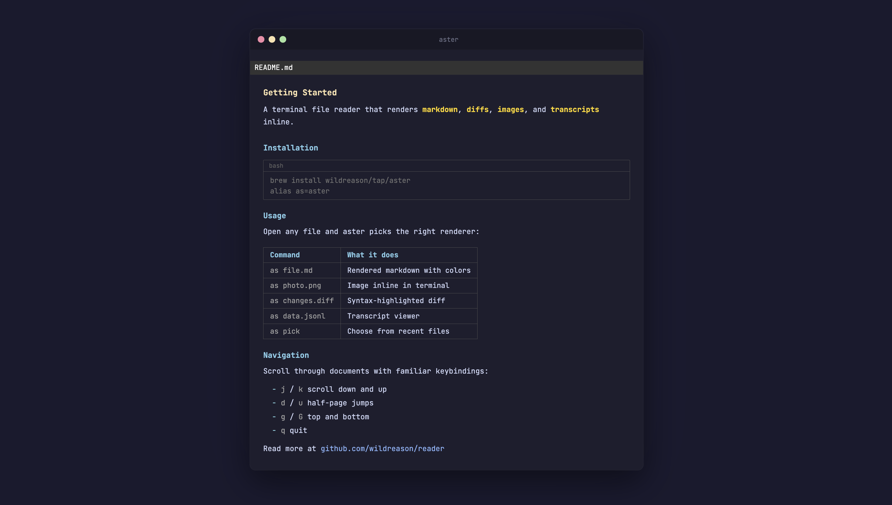

# aster

The human interface for agent work. Renders any file as web or terminal.



Markdown, diffs, CSV, images, video, JSONL transcripts. One binary, auto-detected. Web-first with terminal fallback.

## Install

```bash
brew install wildreason/tap/aster
```

Or build from source:

```bash
git clone https://github.com/wildreason/reader.git
cd reader
make install
```

## Usage

### Web (primary)

```bash
aster readme.md --port 3000        # Serve as web page with live reload
aster data.csv --port 3000         # Sortable, filterable table
aster session.jsonl --port 3000    # Agent transcript as activity feed
aster ~/docs/ --port 8080          # Directory -> web index with routing
```

Open in browser automatically:

```bash
aster readme.md --html > /tmp/doc.html && open /tmp/doc.html
```

### Terminal

```bash
aster readme.md                    # Markdown with colors and tables
aster changes.patch                # Diff with syntax highlighting
aster screenshot.png               # Image inline (iTerm2, Kitty, WezTerm)
aster data.csv                     # CSV as formatted table
aster data.json                    # JSON with highlighting
```

### Shortcuts

```bash
aster pick                         # Choose from recently viewed files
aster latest                       # Open newest file in cwd
```

### Pipes

```bash
git diff | aster
curl -s api.example.com | aster
```

## Web features

- Live reload -- file watcher pushes changes to browser via SSE
- Syntax highlighting -- auto-detected language
- Copy button on code blocks
- Sortable tables -- click headers, numeric-aware
- TOC sidebar -- scroll-spy navigation from headings
- Search -- `/` or `Ctrl+K` for fuzzy search overlay
- CSV filters -- per-column filter inputs, auto-charting for numeric data
- Diff view -- side-by-side with word-level highlighting, collapsible hunks
- Video player -- speed controls, keyboard shortcuts
- Static export -- `--html` outputs self-contained HTML to stdout (no CDN, no server)

## Supported formats

| Format | Extensions |
|--------|-----------|
| Markdown | `.md` `.markdown` |
| CSV / TSV | `.csv` `.tsv` |
| Unified diffs | `.diff` `.patch` |
| JSON | `.json` |
| JSONL transcripts | `.jsonl` |
| Images | `.png` `.jpg` `.gif` `.webp` `.bmp` `.svg` |
| Video | `.mp4` `.webm` `.mov` |
| Plain text | `.txt` `.log` |

Format is auto-detected from the file extension. Override with `-t TYPE`.

## Flags

```
--port N     Serve as web page on localhost:N
--html       Export self-contained HTML to stdout
-t TYPE      Force content type (md, json, jsonl, diff, txt, yaml, csv)
-n           Show source line numbers in gutter
-f           Follow mode (watch file for changes)
```

## Navigation

### Web

```
/ or Ctrl+K     Search
Esc             Close search
Arrow keys      Navigate search results
```

### Terminal

```
j / k           Scroll down / up
d / u           Half-page down / up
g / G           Top / bottom
PgDn / PgUp     Full page down / up
q               Quit
```

## Shell alias

```bash
alias as=aster
```

## Optional dependencies

Terminal image rendering requires [chafa](https://hpjansson.org/chafa/):

```bash
brew install chafa
```

## License

MIT
